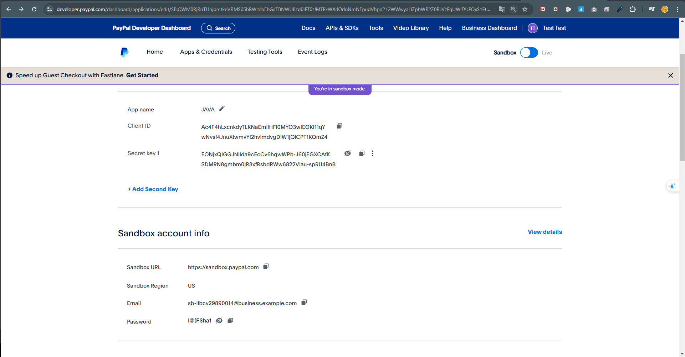
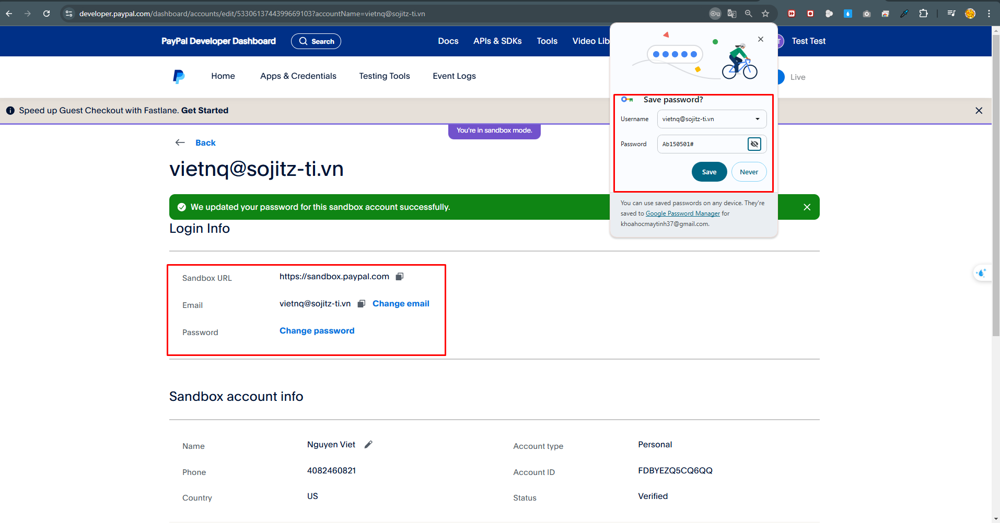

Thông tin cấu hình:
Terminal ID / Mã Website (vnp_TmnCode): Z72XY6TE

Secret Key / Chuỗi bí mật tạo checksum (vnp_HashSecret): HYNFJJMO01VPBQHDNZADQB8IZCQNFR62

Url thanh toán môi trường TEST (vnp_Url): https://sandbox.vnpayment.vn/paymentv2/vpcpay.html

Thông tin truy cập Merchant Admin để quản lý giao dịch:
Địa chỉ: https://sandbox.vnpayment.vn/merchantv2/

Tên đăng nhập: khoahocmaytinh37@gmail.com

Mật khẩu: Ab150501#

Kiểm tra (test case) – IPN URL:
Kịch bản test (SIT): https://sandbox.vnpayment.vn/vnpaygw-sit-testing/user/login

Tên đăng nhập: khoahocmaytinh37@gmail.com

Mật khẩu: Ab150501#

Thẻ test:
Ngân hàng	    NCB
Số thẻ	        9704198526191432198
Tên chủ thẻ	    NGUYEN VAN A
Ngày phát hành	07/15
Mật khẩu OTP	123456

// momo

// paypal
https://developer.paypal.com/
// login admin

// login user

